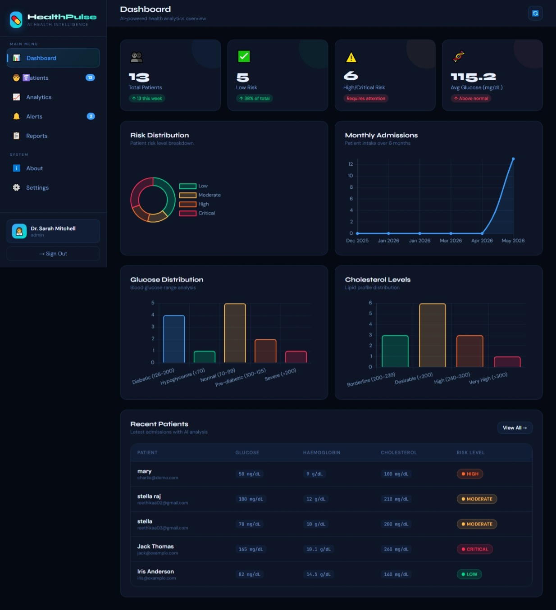
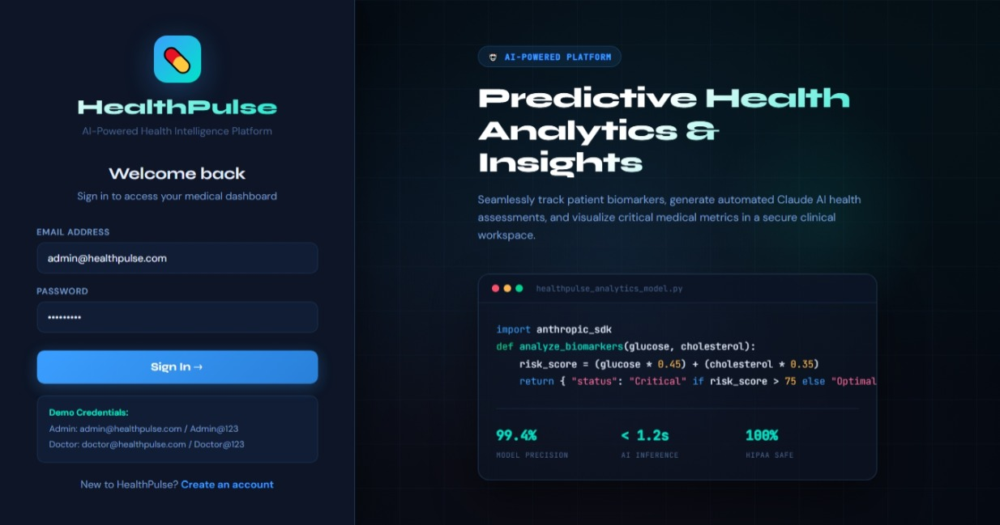
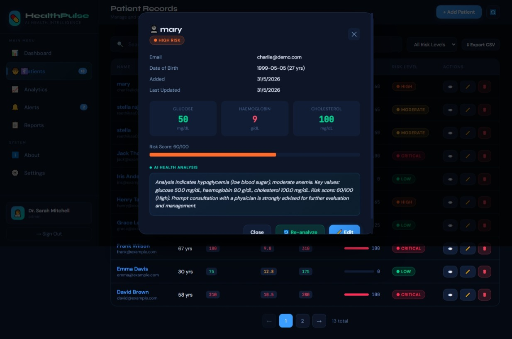
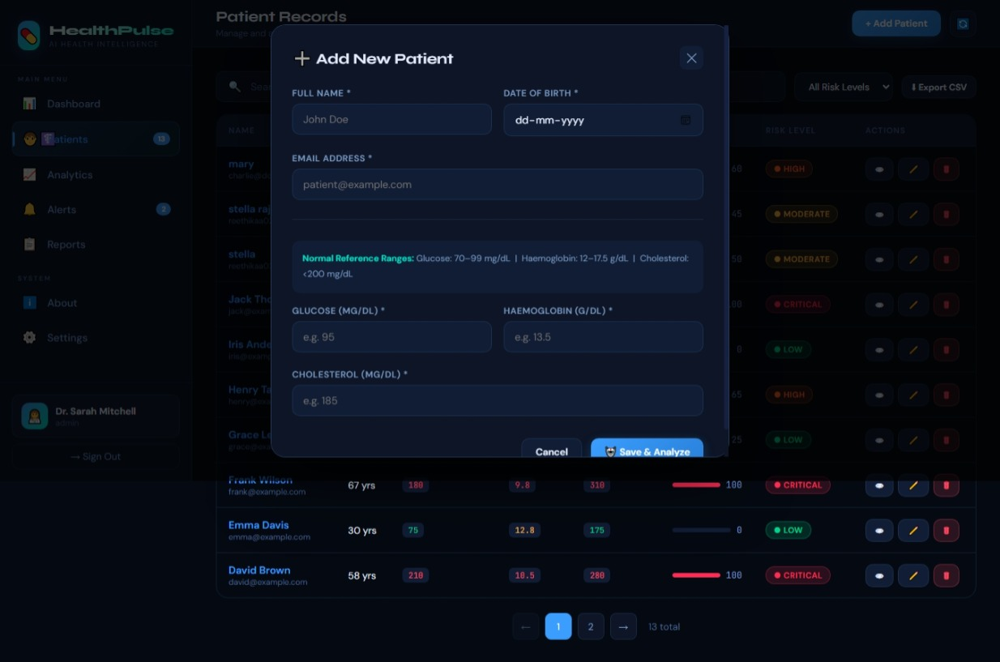
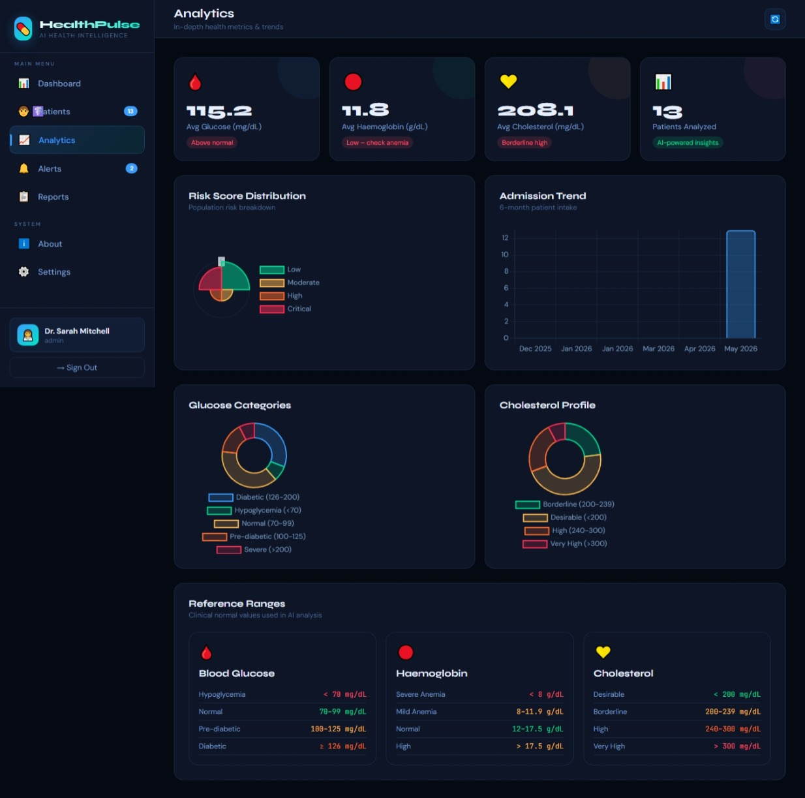
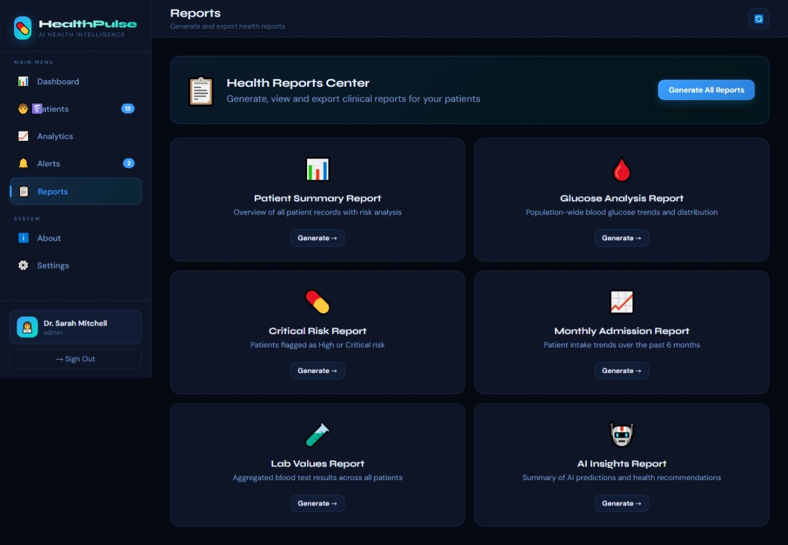
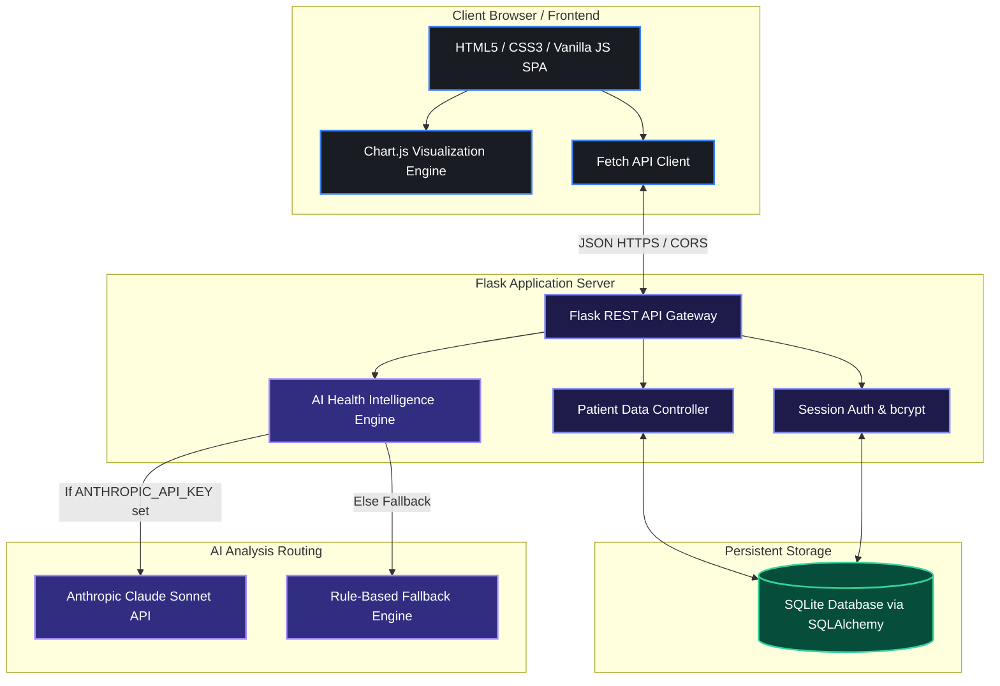

# 💊 HealthPulse — AI-Powered Health Intelligence Platform



HealthPulse is a high-performance, full-stack health prediction web application designed to analyze patient blood biomarkers (Glucose, Haemoglobin, Cholesterol) and predict metabolic risk profiles using modern AI models and clinical rule engines.

---

## 🖼️ Platform Walkthrough & Screenshots

Below are actual screenshots from the HealthPulse application showing the responsive user interface, analytics engine, and diagnostics modal.

#### 1. Glassmorphism Authentication Gateway

*The modern glassmorphic login interface includes a dedicated analytics highlight panel showcasing clinical model performance metrics and credentials for testing.*

#### 2. Clinical Intelligence Dashboard

*The central dashboard utilizes interactive Chart.js widgets to map monthly admissions, risk status distribution, and granular blood marker frequencies across the patient population.*

#### 3. Diagnostic Details & AI Health Analysis

*An interactive diagnostic review modal presenting a patient's exact blood biomarkers, a visual risk meter, and custom Claude AI dynamic health insights.*

#### 4. Biomarker Registration Portal

*The streamlined patient registration form incorporates integrated real-time validation and a neat visual normal-reference-ranges panel.*

#### 5. Population Health Analytics Suite

*A deep-dive analytics suite showcasing polar area graphs for risk scores, admission trend charts, cholesterol profiles, and an interactive clinical reference table.*

#### 6. Specialized Health Reports Center

*The specialized reports hub offers doctors and administrators single-click CSV/PDF generations for admissions, lab values, critical alerts, and AI insights.*

---

## 🏗️ Architecture & Data Flow

HealthPulse is engineered as a secure, decoupling-friendly full-stack application. Below is the system architecture showing how user requests, database storage, and AI analysis pipelines interact.



---

## 🚀 Key Features

* **🔐 Enterprise-Grade Authentication** — Secure login and registration utilizing bcrypt password hashing and session-based state management.
* **📊 Analytics Dashboard** — Real-time clinic stats coupled with 4+ interactive Chart.js visualizations (risk, admissions, blood sugar, lipid profiles).
* **🧑‍⚕️ Full Patient CRUD** — Seamless creation, updating, retrieval, and deletion of patient records with live search, multi-field filtering, and custom sorting.
* **🤖 Smart Clinical Risk AI Engine** — Integrates with Anthropic's Claude API for dynamic clinical assessments, backed by a deterministic, rule-based expert logic fallback.
* **🔔 Critical Alerts** — Automatic risk threshold checking to highlight high-risk patient files needing urgent clinical attention.
* **📋 Specialized Reports** — Comprehensive reports center allowing instant CSV exports of lab values, critical notifications, and metabolic data.
* **⚙️ Custom Preference Settings** — User controls for dashboard configurations and platform options.

---

## 🛠️ Technology Stack

| Layer | Technology | Description |
| :--- | :--- | :--- |
| **Backend** | Python 3.10+ · Flask | Lightweight, robust web micro-framework |
| **Database** | SQLite · SQLAlchemy | Persistent, relative ORM data layer |
| **AI Engine** | Anthropic Claude API / Deterministic Expert Fallback | Advanced LLM synthesis + biomarker evaluation rules |
| **Frontend** | HTML5 · CSS3 · Vanilla JS | Modern SPA design with HSL palettes and glassmorphism |
| **Charts** | Chart.js 4.x | Interactive graphics and data tracking |
| **Security** | bcrypt · CORS | Password encryption & cross-origin access protection |

---

## 📁 Project Structure

```
healthpulse/
├── backend/
│   ├── app.py              # Flask app & middleware entry point
│   ├── database.py         # SQLAlchemy schemas and models
│   ├── ai_service.py       # Claude AI router & rule-based expert engine
│   ├── requirements.txt    # Backend library dependencies
│   └── routes/
│       ├── auth.py         # Authentications (/register, /login, /logout, /me)
│       ├── patients.py     # Patient record CRUD, filtering, & AI triggering
│       └── dashboard.py    # Analytics & aggregate dashboard statistics
├── frontend/
│   └── index.html          # Beautiful Single-Page App (HTML, CSS, JS)
└── Screenshot/             # Application visual walkthrough assets
```

---

## ⚙️ Quick Start Guide

### 1. Set Up Environment & Install Dependencies

```bash
# Clone the repository
git clone https://github.com/your-username/healthpulse.git
cd healthpulse/backend

# Install required packages
pip install -r requirements.txt
```

### 2. Configure AI Capabilities (Optional)

To enable custom Claude AI health insights, set your Anthropic API Key environment variable:

```bash
# Windows (PowerShell)
$env:ANTHROPIC_API_KEY="your_actual_anthropic_api_key"

# Linux / macOS
export ANTHROPIC_API_KEY="your_actual_anthropic_api_key"
```

> [!NOTE]
> **API Key Scope**: The `ANTHROPIC_API_KEY` is utilized strictly for generating the conversational **AI Health Remarks** (personalized clinical summaries). If not provided, the platform automatically redirects diagnostics to a robust built-in **Rule-Based Expert System** which calculates exact risk scores (0–100) and risk levels (Low, Moderate, High, Critical) deterministically.

### 3. Launch the Backend Server

```bash
# Start Flask server (runs on port 5000 by default)
python app.py
```

*Backend server spins up at: `http://localhost:5000`*

### 4. Serve the Frontend Interface

To serve the Single-Page Application, open `frontend/index.html` directly in any modern browser, or run a local HTTP server:

```bash
cd ../frontend
python -m http.server 3000
```

*Visit the platform at: `http://localhost:3000`*

---

## 🔑 Demo Access Credentials

To explore the clinical workspace, use the credentials below at the login screen:

| Role | Email Address | Password |
| :--- | :--- | :--- |
| **Administrator** | `admin@healthpulse.com` | `Admin@123` |
| **Doctor** | `doctor@healthpulse.com` | `Doctor@123` |

---

## 🩺 AI Health Analysis Specifications

The platform analyzes three key blood biomarkers using clinical risk scoring:

| Marker | Normal Range | Risk Thresholds & Classification |
| :--- | :--- | :--- |
| **Glucose** | 70–99 mg/dL | `<70` Hypoglycemia · `100–125` Pre-Diabetes · `≥126` Diabetes |
| **Haemoglobin** | 12.0–17.5 g/dL | `<8` Severe Anemia · `8–11.9` Moderate/Mild Anemia |
| **Cholesterol** | <200 mg/dL | `200–239` Borderline High · `≥240` High Hypercholesterolemia |

---

## 📡 API Reference Endpoints

### Authentication Group
* `POST /api/auth/register` — Create a new clinical account.
* `POST /api/auth/login` — Authenticate user credentials and establish a session.
* `POST /api/auth/logout` — Terminate current session.
* `GET  /api/auth/me` — Retrieve active user session metadata.

### Patient Management Group
* `GET  /api/patients/` — Query patients (supports pagination, search, risk filtering, sorting).
* `POST /api/patients/` — Create new patient file & trigger immediate AI biomarkers analysis.
* `GET  /api/patients/:id` — Retrieve comprehensive single patient record.
* `PUT  /api/patients/:id` — Modify patient biomarkers and trigger re-analysis.
* `DELETE /api/patients/:id` — Permenantly remove patient record.
* `POST /api/patients/:id/reanalyze` — Force AI re-evaluation of biomarker metrics.

### Analytics Group
* `GET  /api/dashboard/stats` — Fetch aggregate dataset metrics and Chart.js feeds.

---


